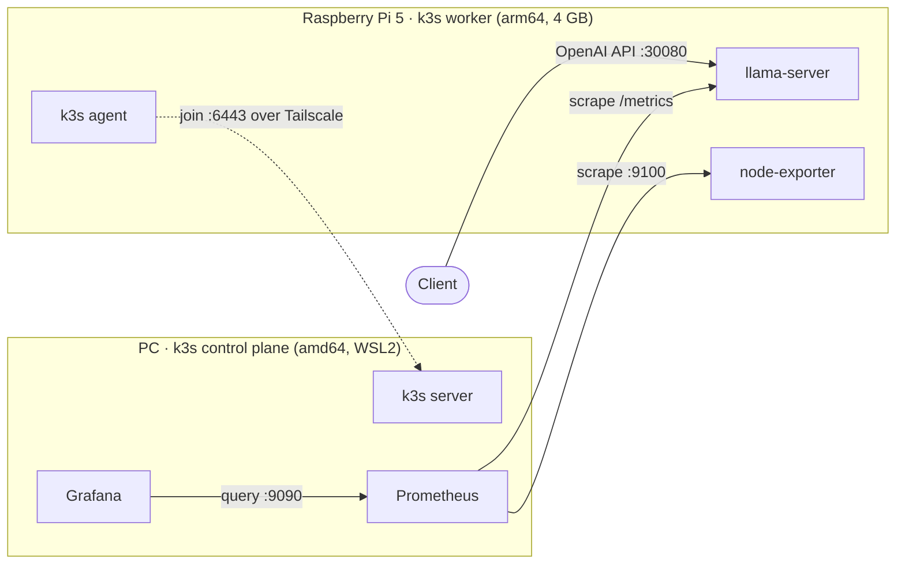
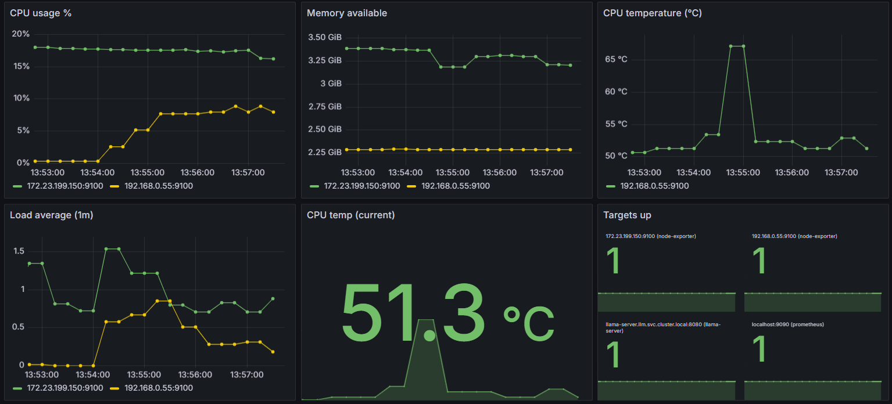
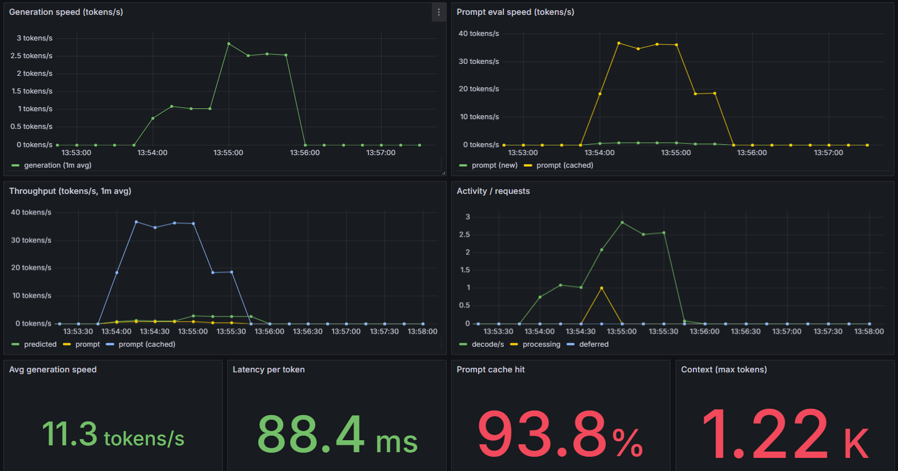

# 🦙 Edge LLM on k3s + Observability

> A two-node, mixed-architecture **k3s** cluster that serves a small LLM from a
> Raspberry Pi 5 and is monitored from a PC — all connected over a **Tailscale**
> mesh and provisioned with **Ansible**.

[](https://k3s.io)
[](https://www.ansible.com)
[](https://github.com/ggml-org/llama.cpp)
[](https://prometheus.io)
[](https://grafana.com)
[](LICENSE)

## Overview

A self-contained edge AI lab:

- **LLM serving** — `llama-server` (llama.cpp) runs **Qwen2.5 1.5B Instruct (Q4_K_M)**
  on a Raspberry Pi 5 (4 GB) and exposes an **OpenAI-compatible API**.
- **Two-node k3s** — a PC (WSL2, amd64) is the **control plane**; the Pi (arm64) is
  the **worker**. The workload is pinned to the Pi with a `nodeSelector`.
- **Observability** — Prometheus + Grafana run on the PC and scrape the Pi
  (and the PC) through cluster-internal DNS.
- **Networking** — both nodes join a private **Tailscale** mesh; k3s itself is
  configured to use the tailnet (`node-ip` + `flannel-iface: tailscale0`), so
  cross-node pod traffic works even though the WSL control plane is behind NAT.
- **Infrastructure as Code** — a single idempotent Ansible playbook provisions the
  Pi, joins it to the cluster and applies the manifests.

## Architecture



The cluster is **mixed-architecture**: the LLM image only exists for arm64, and
the Pi is reachable from the PC over the tailnet.

## Components

| Component      | Where | Purpose                                                |
|----------------|-------|--------------------------------------------------------|
| k3s server     | pc    | control plane, `kubectl`                               |
| k3s agent      | rpi5  | runs the workloads                                     |
| llama-server   | rpi5  | LLM inference, OpenAI-compatible API (NodePort `30080`) |
| node-exporter  | both  | host metrics on `:9100`                                |
| Prometheus     | pc    | scrapes node-exporter and llama-server                 |
| Grafana        | pc    | dashboards (NodePort `30300`)                          |
| Tailscale      | both  | private mesh network                                   |

Model: **Qwen2.5 1.5B Instruct, Q4_K_M** (~1.1 GB).

## How it works

**Serving a request**

1. A client calls `http://<pi-ip>:30080/v1/chat/completions`.
2. The NodePort Service forwards to the `llama-server` pod on the Pi.
3. The pod reads the model from a `hostPath` PersistentVolume (downloaded by Ansible).

**Collecting metrics**

1. `node-exporter` (a DaemonSet) runs on every node on `:9100`.
2. `llama-server` exposes model metrics on `:8080/metrics`.
3. Prometheus (on the PC) discovers both through the headless `node-exporter`
   Service and scrapes the LLM Service.
4. Grafana queries Prometheus and renders the dashboard.

## Dashboard





Node CPU / memory / load / CPU-temperature plus LLM metrics: tokens/s, prompt
eval speed, throughput, totals and prompt-cache hit ratio.

## Repository layout

```
ansible/             cluster provisioning (Ansible, manages pc + rpi5)
raspberry/manifests/ edge workloads (LLM)
pc/monitoring/       observability workloads (Prometheus + Grafana + dashboard JSON)
docs/                architecture and design decisions
```

## Prerequisites (manual, once)

1. **PC**: k3s server installed and running.
2. **PC and Pi**: Tailscale installed and logged in.
3. **SSH** from the PC to the Pi (`ssh-copy-id pi@<pi-ip>`).
4. `inventory.yml` filled in with the Pi's address/user.
5. Passwordless **sudo** on the Pi (Raspberry Pi OS default). Never run the
   playbook with `sudo`; if the local sudo asks for a password use `EXTRA="-K"`.

## Deploy

```bash
cd ansible
make install EXTRA="-K"   # provisions the Pi, joins the cluster, applies manifests
make verify               # checks the cluster and the LLM API
```

## Using the API

`llama-server` speaks the OpenAI API and is reachable on any IP of the worker
(Tailscale or LAN):

```bash
curl http://<pi-ip>:30080/v1/models

curl http://<pi-ip>:30080/v1/chat/completions \
  -H 'Content-Type: application/json' \
  -d '{"model":"qwen2.5-1.5b",
       "messages":[{"role":"user","content":"Hello"}]}'
```

It also serves a **built-in web UI** at `http://<pi-ip>:30080/`.

Any OpenAI-compatible client works (Open WebUI, Chatbox, opencode, the Python
SDK…). Example opencode provider:

```json
{
  "provider": {
    "llama.cpp": {
      "npm": "@ai-sdk/openai-compatible",
      "name": "llama-server (local)",
      "options": { "baseURL": "http://<pi-ip>:30080/v1" },
      "models": { "qwen2.5-1.5b": { "name": "Qwen2.5 1.5B (local)" } }
    }
  }
}
```

## Monitoring

- **Grafana**: `http://localhost:30300` (login `admin`, password in
  `pc/monitoring/grafana-admin.env`).
- **Prometheus**: cluster-internal `prometheus.monitoring.svc:9090`.
- Raw metrics: `node-exporter` on `:9100`, llama-server on `:30080/metrics`.

## Design decisions

Highlights (full rationale in [`docs/DECISIONS.md`](docs/DECISIONS.md)):

- **k3s** over kubeadm: one binary, fits a 4 GB edge node.
- **Control plane on the PC**, worker on the Pi: the constrained device only runs workloads.
- **k3s over Tailscale** (`node-ip` + `flannel-iface`): the WSL control plane is behind NAT, so pod traffic uses the tailnet.
- **Official multi-arch llama.cpp image** instead of a custom build.
- **NodePort** (no Ingress/LB) and **headless Service + DNS SD** so Prometheus scrapes every node.
- **Dashboard & secret generated with `kubectl`** (`--from-file` / `--from-env-file`), keeping the JSON editable and the secret out of Git.

## Troubleshooting

- **Worker won't join** → check `tls-san` includes the PC's Tailscale IP, and that
  the nodes see each other on the tailnet (`tailscale ping`).
- **A service on one node is unreachable from the other** → both nodes must use
  `node-ip` + `flannel-iface: tailscale0` (handled by the playbook).
- **Grafana from Windows** → install Tailscale on Windows, or use the Pi's LAN IP,
  or a `kubectl port-forward`.
- **OOM / restarts** → lower `--ctx-size` or the memory limit in
  `raspberry/manifests/20-llama-server.yaml`.

## Roadmap

- [x] Two-node k3s cluster over Tailscale
- [x] llama-server on the Raspberry Pi (OpenAI-compatible API)
- [x] node-exporter + Prometheus + Grafana (node and LLM dashboards)
- [ ] Alerts (Alertmanager) and a richer Grafana dashboard
- [ ] CI to lint Ansible + manifests

## License

[MIT](LICENSE)
